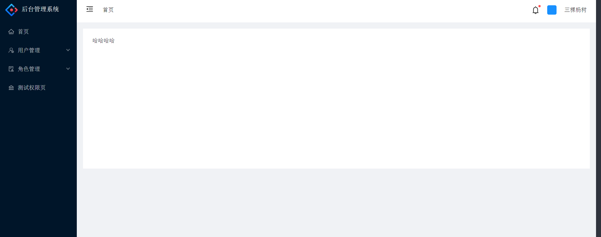
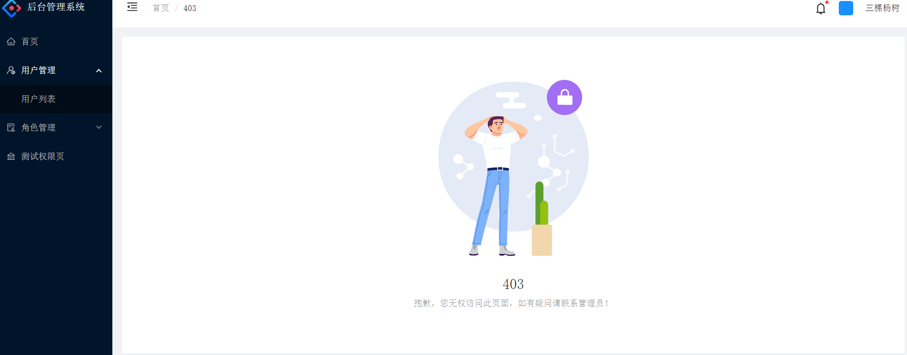

# react-ts-template-admin

:star: :star: :star: :star: :star:

### 升级及更名提示

[react-ts-template-admin] 现已升级为 [ **react-template-admin** ]，最新版使用 Vite + TS 构建，更轻量级、高性能！

请移步至新仓库：[react-template-admin](https://github.com/sankeyangshu/react-template-admin)

### ---------------------------------------------

### 下面是旧版介绍

#### 介绍

这是一个用 React 和 TypeScript 开发的一个后台管理系统的模版，是一个比较精简的框架，方便自己快速开发，使用 react hooks 开发的后台管理系统模版，精简了很多不必要的代码，此项目一定程度上参考了[ react-antd-multi-tabs-admin](https://github.com/hsl947/react-antd-multi-tabs-admin)，大家也可以去看看该项目。

**注 1：此项目属于个人学习项目，仅供学习和技术研究使用，不建议商用。**

**注 2：如果对您有帮助，您可以点右上角 "Star" 支持一下 谢谢！**

#### 软件架构

react + ts +less。。。

#### 安装教程

##### 前序准备

你需要在本地安装 [node](http://nodejs.org/) ，node 需要 12.0 以上版本

```bash
git clone git@github.com:1260323835/react-ts-template-admin.git

cd react-ts-template-admin

npm install

npm start
```

#### 项目截图

##### 登录


##### 首页



##### 错误页面



#### 路由/菜单配置

```bash
# 所有路由写在 /src/router/index.ts （包括菜单栏的路由）
  用于路由权限控制

# 左侧菜单路由写在 /src/config/menu.ts
  仅用于菜单栏展示

# 分两套的原因是，方便维护，如果不嫌麻烦，可以都写在 routes 里，用一个字段标识菜单路由即可
```

#### 参与贡献

1.  Fork 本仓库
2.  新建 Feat_xxx 分支
3.  提交代码
4.  新建 Pull Request

#### 许可证

[MIT License](https://github.com/1260323835/react-ts-template-admin/blob/main/LICENSE)
